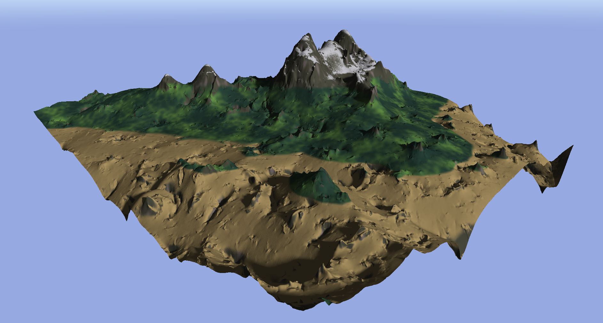
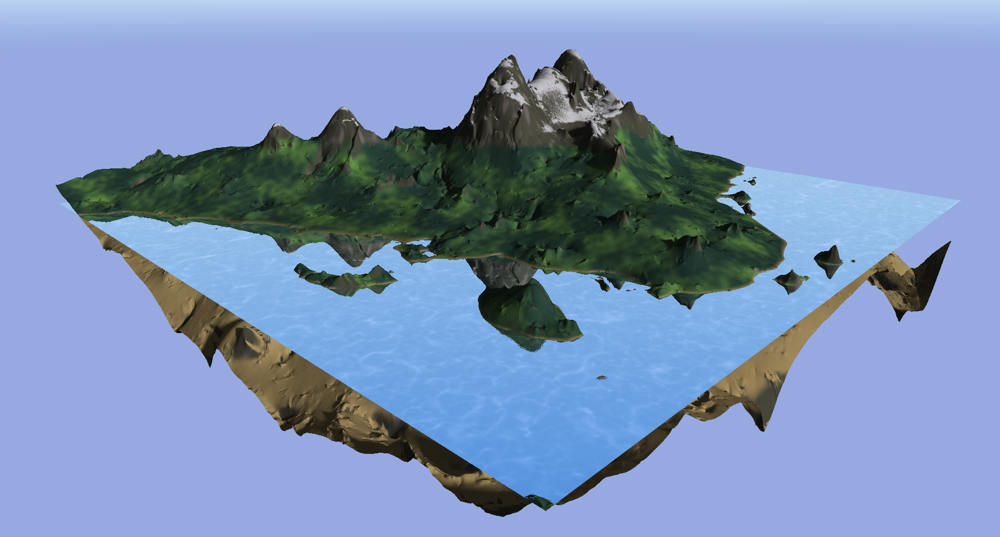
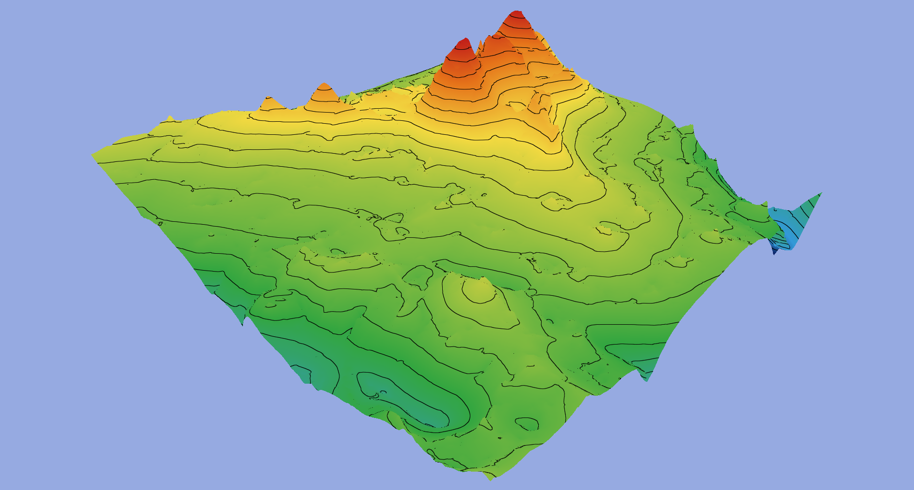
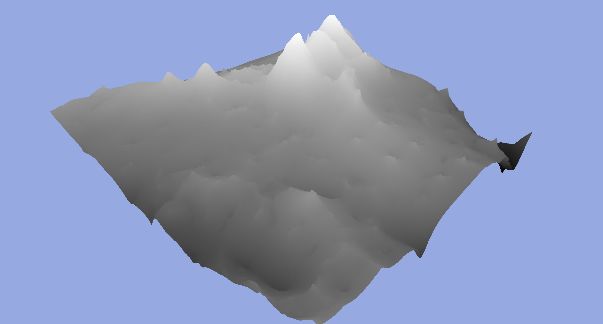
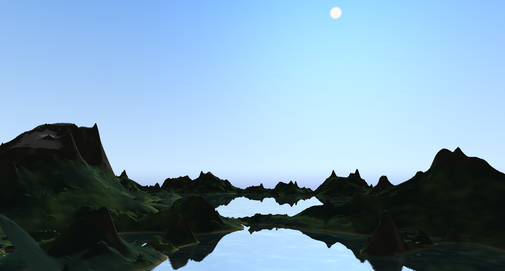
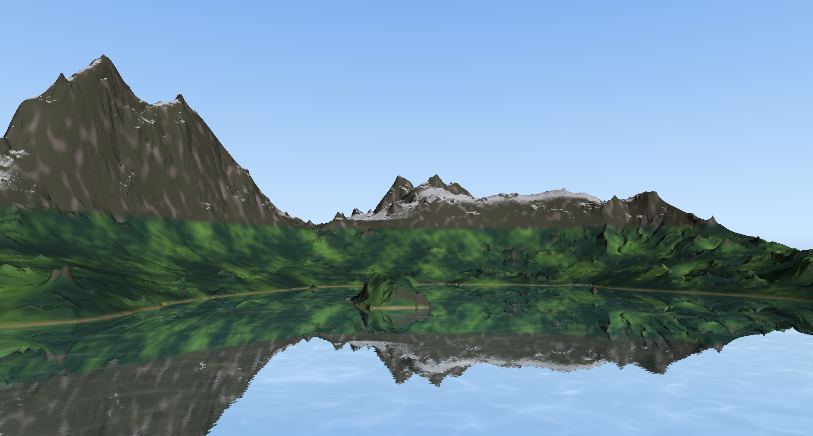
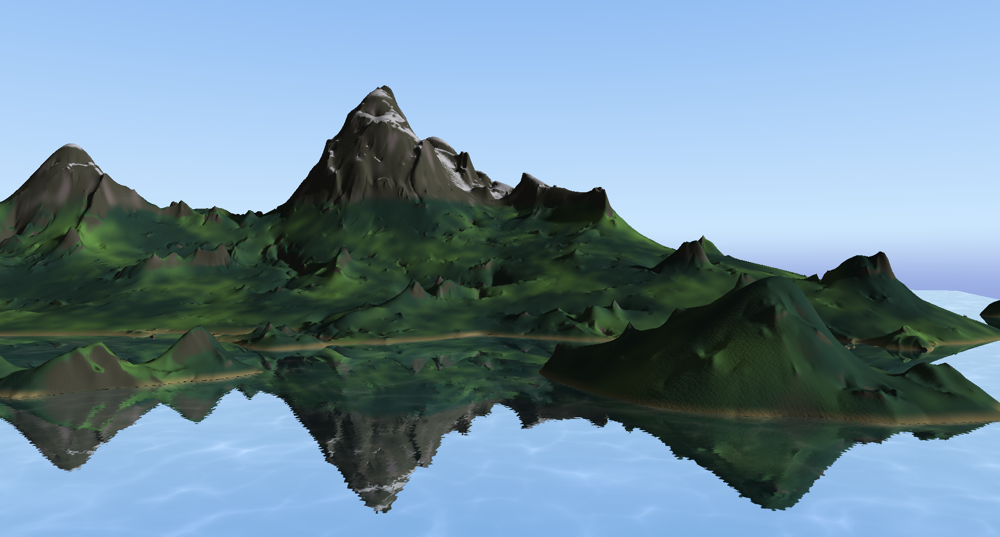

### Terrain Generator & Visualizer

An OpenGL-based procedural terrain generator driven by UDF.

---

## Key Features

- **Terrain Generation:** Wraps UDF into a GLSL compute shader.
- **Raymarched Shadows:** Computes baked directional shadows using raymarching.
- **Procedural Skybox:** Features dynamic vertical atmospheric gradients and a sun disk with halo glow.
- **Water & Caustics Shader:** Simulates terrain reflections and warped Voronoi water caustics.
- **Color Mapping:** Supports multiple height-base altitude ramps.

---

## Gallery 

| Generated Terrain | With Water |
| :---: | :---: |
|  |  |

| Altitude Map | Greyscale Heightmap |
| :---: | :---: |
|  |  |


<p align="center">
    
    
    
</p>

---

## Dependencies

- **GLFW**: Window Management
- **GL3W**: OpenGL Function Loading
- **OpenGL**: Rendering
- **GLM**: Math
- **ImGui**: GUI
- **LodePNG**: PNG import/export

---

## Build

```cmake -B build```
```cmake --build build```

---

## Run

*Runs only on Linux.*
*By default uses discrete GPU.*

```./build/tgv [options]```

Options:
- `--log`: Logs to console various information during runtime.
- `--debug`: Enables OpenGL debug callback.
- `--integrated`: Uses integrated GPU instead of discrete.
